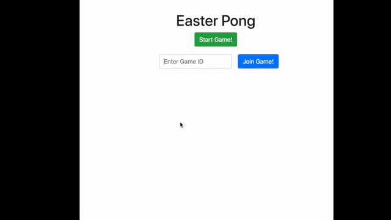

# Easterhack

## Easter Pong

Pong 2 player game implemented using Node and Vanilla JS. See /backend or /backend/frontend for implementation



## Run or deploy

```
cd /backend
npm run dev
```

Addionally we have backend/Dockerfile for running in containers. See `/backend` directory for more details.

## Learnings

TODO
